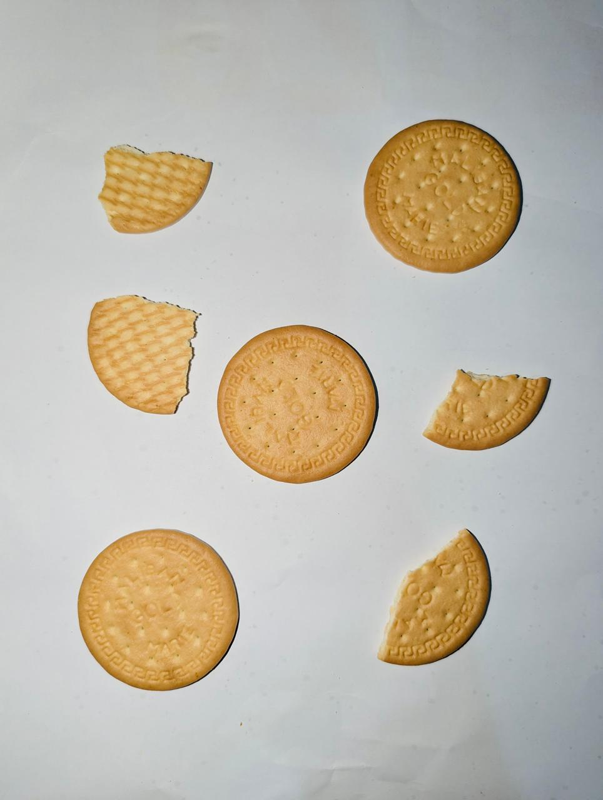
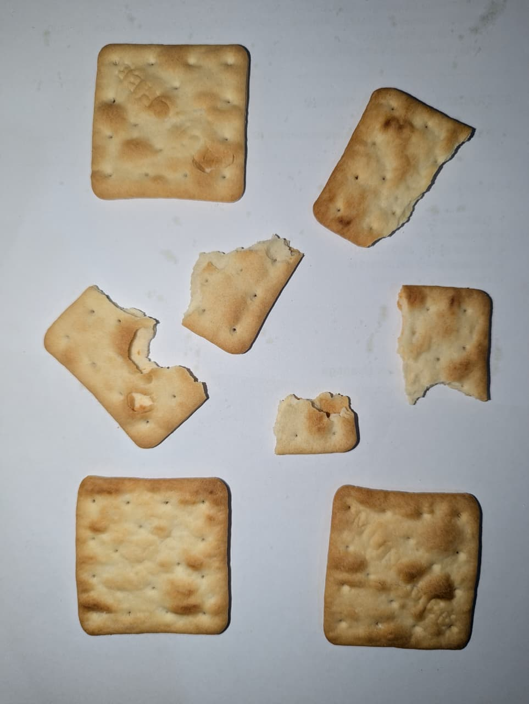
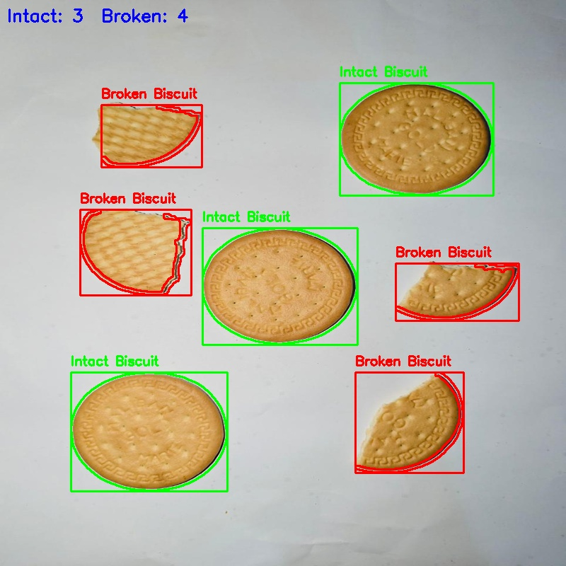
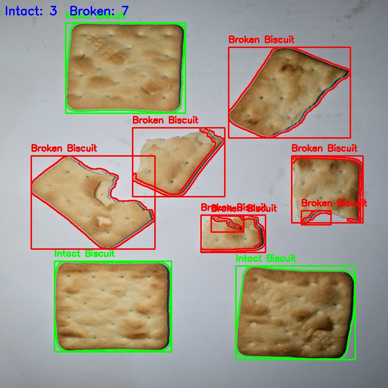

# Broken Biscuit Detection using Classical Image Processing Techniques

## Project Title
Broken Biscuit Detection using Classical Image Processing

---

## Problem Description

This project focuses on automatically identifying whether biscuits are **intact or broken** using image processing techniques.

Manual inspection is time-consuming and inconsistent. Therefore, this system analyzes biscuit images and determines their condition based on shape properties.

The system assumes a simple background to accurately detect biscuit boundaries.

This project uses only classical image processing techniques (no machine learning).

---

## Tools and Libraries Used

- Python 3.x  
- OpenCV (cv2)  
- NumPy  
- OS Module  

---

## Image Processing Methods Used

The system follows an edge-based detection pipeline:

1. Convert image to grayscale  
2. Apply Gaussian blur to reduce noise  
3. Perform Canny edge detection  
4. Use morphological operations to improve edges  
5. Extract contours from the image  
6. Calculate shape features:
   - **Circularity** → measures roundness  
   - **Solidity** → measures shape completeness  
7. Classification:
   - **Intact Biscuit** → High circularity and solidity  
   - **Broken Biscuit** → Irregular shape  

---

## Instructions to Run the Code

```bash
git clone https://github.com/madhawasohan-ux/broken-biscuit-detection.git
cd broken-biscuit-detection
pip install opencv-python numpy
python main.py
```
---

## Example Output Images

### Input




### Output



